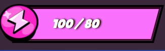

# <b> ` Brawl Stars Store ` </b>

 
    Bem-Vindo a Brawl Stars Store.

    Os jogadores de Brawl Stars sonham em ter uma loja que possibilite a compra de itens para seus brawlers pela internet, a sua tarefa é tornar estes sonhos em realidade.

# `Regras`

1. Este projeto deve ser desenvolvido utilizando VueJs.

2. Toda a parte visual deve ser feita utilizando `HTML` e `CSS`, `não` é permitida a utilzição de frameworks css como bootstrap, vuetify etc...

3. Crie um componente capaz de representar um `brawler` do item `Meus Brawlers`, utilize os conceitos vistos durante o exercicio `Mega Sena da Virada`.

4. Da mesma forma do item acima, crie um componente capaz de representar uma `oferta`.

5. Utilize os recursos do VueJs para construir a tela com todos os `brawlers` e `ofertas` de forma dinâmica.

6. Todos os dados exibidos na tela devem ser exibidos dinâmicamente utilizando os dados localizados na pasta `data`.

7. Ao clicar em uma oferta deve ser realizado a compra de ` pontos de poder` para o brawler em questão, caso o jogador tenha moeda ou gema suficiente debite o valor do item adquirido do saldo total. `Lembre-se de que o pagamento deve ser feito na mesma moeda exibida na oferta`.

9. O saldo de moedas nunca deve ficar negativo. 

10. Nos aceitamos como forma de pagamento `moedas` e `gemas`, portanto ao realizar uma compra você deve validar se exite saldo suficiente para o mesmo.

| ` Moeda ` | ` Gema ` | 
|-----------|:-----------
|| 

11. Caso a quantidade de poderes adquiridos seja maior que o total permitido você deve atribuir o valor maximo.

| ` Errado ` | ` Certo ` | 
|-----------|:-----------
|| 

12. Todas as imagens e artes estão disponíveis na pasta `assets`, caso não encontre você devera utilizar suas habilidades com `HTML` e `CSS` para criar os demais elementos.

13. O layout do seu projeto deve ser igual a foto da primeira página deste arquivo.

14. Para facilitar o desenvolvimento, todos os arquivos necessarios para a construção do projeto ja foram criados, observe os comentarios e desenvolva cada parte do projeto nos locais indicados.

# <b>`Dicas` </b>
- Procure utilizar a propriedade `width` com valores percentuais, para que seu projeto possa se tornar mais responsivel.
- Pergunte sempre que tiver dúvida.
- Adicione uma extensão chamada `Colorzilla` para descobrir as cores de cada item da tela.
    ( `Talvez seja necessário dar permissão para acessar arquivos locais. ` ).
-    Estude um pouco sobre `display: flex`, `position: absolute` e `position: relative`, ira te ajudar no posicionamento dos elementos na tela.

## Links Úteis

- https://www.w3schools.com/css/css3_gradients.asp

- https://www.w3schools.com/css/css3_2dtransforms.asp

- https://www.w3schools.com/cssref/css3_pr_transform.asp

- https://www.youtube.com/watch?v=5PS6ku8NzIE&list=PLirko8T4cEmx5eBb1-9j6T6Gl4aBtZ_5x