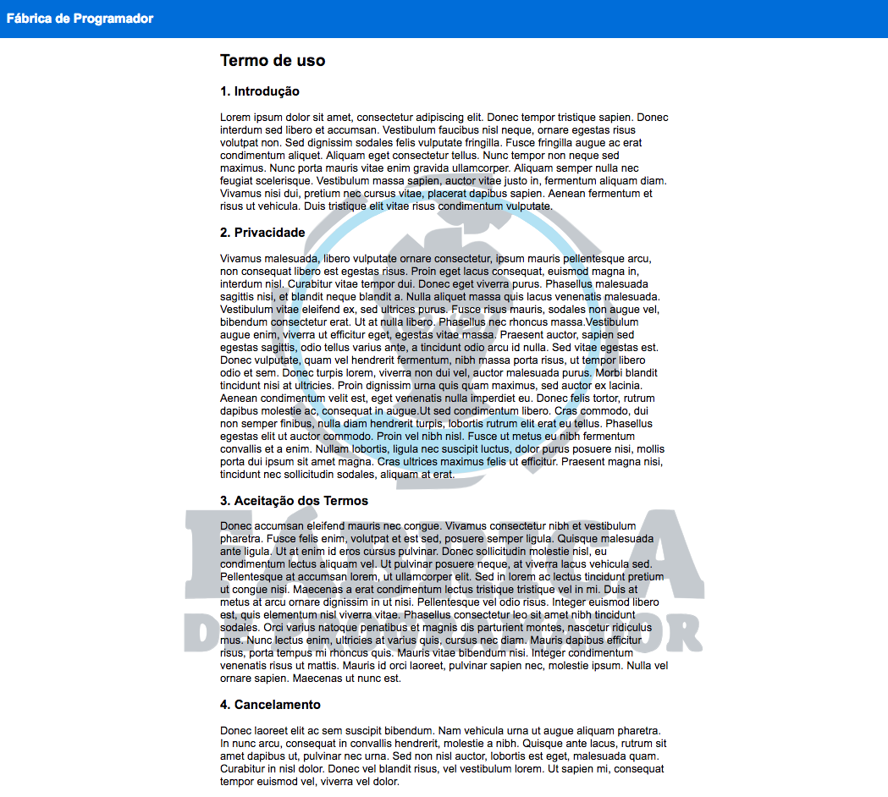

# ``Termo de Uso ``

Startups de tecnologia e sites utilizam frequentemente a figura do termo de uso para que os usuários/clientes possam usufruir de seus serviços. Trata-se de um documento que traz em seu texto as condições e regras para que um usuário do site ou app possa utilizar o serviço que está sendo oferecido. No entanto, este contrato vai além disso: visa delimitar a responsabilidade a que o dono do site ou app está sujeito.

Diante desta condições o novo site do Fábrica de Programador precisa de uma página que descreve os termos de uso para os alunos, portanto, desenvolva uma página de termo de uso utilizando Vue.JS tendo como base a imagem abaixo.

Utilize o [Lorem Ipsum](https://www.lipsum.com/feed/html), para gerar o texto apresentado em cada tópico do termo.

Vale lembrar que todos os textos exibidos na tela devem estar dentro do atributo data da instancia de Vue.

Os dados do termo de uso devem estar dentro da mesma instancia, cada item deve ser representado por um objeto que contém os atributos titulo e texto. 
O titulo "Fábrica de Programador" deve estar em uma instância diferente do termo.

[Clique aqui](https://drive.google.com/file/d/1ne-FhEe7C6XPJZdk_22mNhv2e0dG10X5/view?usp=sharinglink) para fazer o download da logo do fábrica de programador e utiliza-la como marca-d'água.

### `` Utilize a interpolação para realizar este exercício ``
